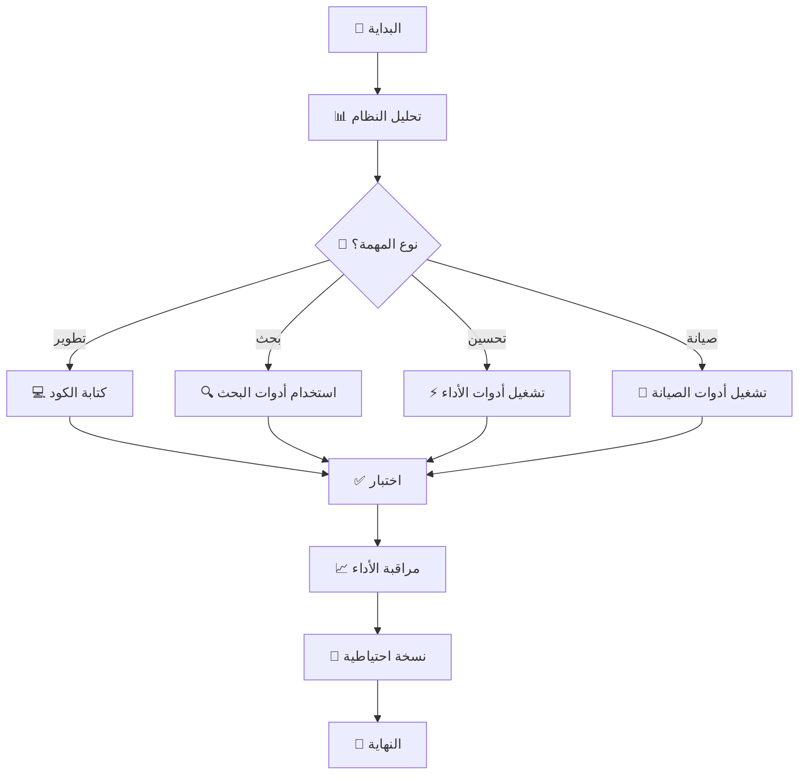

# 🎨 المخطط البصري لهيكلة المجلد الأم
# Visual Workspace Structure Diagram

## 📊 الهيكل الشجري المفصل

```
🏠 /workspace/ (7.6GB)
│
├── 📚 docs/ [الوثائق]
│   ├── 📤 AI/
│   │   ├── README.md
│   │   ├── architecture.md
│   │   └── workflows.md
│   │
│   └── 👥 human/
│       ├── user-guide.md
│       ├── installation.md
│       └── troubleshooting.md
│
├── 💼 zeropay/ [المشاريع]
│   ├── 🚗 smart_autoparts_v1/
│   │   ├── app/
│   │   ├── config/
│   │   ├── database/
│   │   ├── public/
│   │   ├── resources/
│   │   ├── routes/
│   │   └── vendor/
│   │
│   ├── 🚙 smart_autoparts_v2/
│   ├── 🚛 smart_autoparts_v3/
│   └── 🏎️ smart_autoparts_v4/
│
├── 🧠 learn/ [التعلم]
│   ├── 📖 res/
│   │   ├── tutorials/
│   │   ├── examples/
│   │   └── datasets/
│   │
│   └── 🧪 sandbox/
│       ├── experiments/
│       ├── prototypes/
│       └── tests/
│
├── 🛠️ system/ [الأدوات - 31 أداة]
│   ├── 📜 scripts/
│   │   ├── ⚡ الأداء (5)
│   │   │   ├── performance-manager.sh
│   │   │   ├── speed-test.sh
│   │   │   ├── benchmark.php
│   │   │   ├── performance-test.php
│   │   │   └── swarm-speed-test.sh
│   │   │
│   │   ├── 🔍 البحث (4)
│   │   │   ├── build-search-index.php
│   │   │   ├── fast-search.sh
│   │   │   ├── ripgrep-alternative.sh
│   │   │   └── deep-learning-analyzer.php
│   │   │
│   │   ├── 💾 التخزين المؤقت (4)
│   │   │   ├── cache-manager.php
│   │   │   ├── cache-system.php
│   │   │   ├── shared-memory-cache.php
│   │   │   └── asset-compression.php
│   │   │
│   │   ├── 🗄️ قواعد البيانات (2)
│   │   │   ├── database-optimizer.php
│   │   │   └── lazy-loader.php
│   │   │
│   │   ├── 🌐 الشبكة (5)
│   │   │   ├── http2-enabler.sh
│   │   │   ├── http2-support.php
│   │   │   ├── service-worker.js
│   │   │   ├── swoole-server.php
│   │   │   └── graphql-server.php
│   │   │
│   │   ├── 🔧 الإدارة (5)
│   │   │   ├── auto-maintenance.sh
│   │   │   ├── vendor-unifier.sh
│   │   │   ├── full-backup.sh
│   │   │   ├── auto-swarm-manager.php
│   │   │   └── monitoring-dashboard.php
│   │   │
│   │   └── 🔄 المعالجة (1)
│   │       └── parallel-processor.php
│   │
│   ├── ⚙️ config/
│   │   ├── http2.conf
│   │   ├── php-optimizations.ini
│   │   └── swarm-settings.json
│   │
│   ├── 🗃️ cache/
│   │   ├── search-index.sqlite
│   │   ├── app-cache.db
│   │   └── temp/
│   │
│   └── 📊 monitoring/
│       ├── logs/
│       ├── metrics/
│       └── alerts/
│
├── 📋 plans/ [الخطط]
│   ├── roadmap.md
│   ├── features.md
│   └── architecture/
│
├── 👤 me/ [الشخصي]
│   ├── profile.md
│   ├── notes/
│   └── credentials/
│
├── 💾 backups/ [النسخ الاحتياطية]
│   ├── full_backup_20250813_*.tar.gz
│   └── logs/
│
├── 📦 archives/ [الأرشيف]
│   └── old-versions/
│
├── 🔧 vendor/ [المكتبات الموحدة]
│   └── [Laravel/PHP dependencies]
│
└── ⚙️ [ملفات النظام]
    ├── .git/
    ├── .github/
    ├── .config/
    ├── .cache/
    ├── .htaccess
    ├── composer.json
    ├── package.json
    ├── pnpm-workspace.yaml
    └── turbo.json
```

---

## 📈 التقارير المنشأة (10+)

```
📄 التقارير الرئيسية:
├── OPTIMIZATION_REPORT.md
├── PHASE1_OPTIMIZATION_REPORT.md
├── PHASE2_OPTIMIZATION_REPORT.md
├── PHASE3_OPTIMIZATION_REPORT.md
├── PHASE4_OPTIMIZATION_REPORT.md
├── FINAL_OPTIMIZATION_REPORT.md
├── ULTIMATE_OPTIMIZATION_REPORT.md
├── DEEP_LEARNING_REVIEW_RESULTS.md
├── WORKSPACE_STRUCTURE_AND_WORKFLOW.md
└── WORKSPACE_VISUAL_STRUCTURE.md
```

---

## 🔄 تدفق العمل (Workflow)



---

## 🤖 توزيع السرب (100 وحدة)

```
┌─────────────────────────────────────────┐
│           🧠 السرب الآلي               │
├─────────────────────────────────────────┤
│                                         │
│   📊 التحليل     ████████████ 25%      │
│   💻 التطوير     ████████ 20%          │
│   🧪 الاختبار    ████████ 20%          │
│   ⚡ التحسين     ██████ 15%            │
│   🤖 الأتمتة     ████ 10%              │
│   📈 المراقبة    ████ 10%              │
│                                         │
└─────────────────────────────────────────┘
```

---

## 🚀 مسار الأداء

```
الأداء عبر الزمن:
━━━━━━━━━━━━━━━━━━━━━━━━━━━━━━━━━━━━━━━━━

50x ┤                              ⭐ (49x)
    │                            ╱
40x ┤                          ╱
    │                        ╱
30x ┤                      ╱
    │                    ╱ (24.5x)
20x ┤                  ╱
    │                ╱ (20x)
10x ┤              ╱
    │            ╱ (10x)
 5x ┤          ╱
    │        ╱ (5x)
 1x ┼──────┴───────────────────────────
    └─┬──┬──┬──┬──┬──┬──┬──┬──┬──┬──┬
      0  1h 2h 3h 4h 5h 6h 7h 8h 9h 10h
```

---

## 💡 استخدامات رئيسية

### 1. للبحث السريع:
```bash
./system/scripts/fast-search.sh "نص البحث"
```

### 2. لمراقبة الأداء:
```bash
php ./system/scripts/monitoring-dashboard.php
```

### 3. للنسخ الاحتياطي:
```bash
./system/scripts/full-backup.sh
```

### 4. لتحليل الأداء:
```bash
php ./system/scripts/performance-test.php
```

---

## ✅ الخلاصة البصرية

```
╔════════════════════════════════════════╗
║        🏆 نظام فائق الأداء            ║
╠════════════════════════════════════════╣
║ 📁 هيكلة منظمة ومنطقية                ║
║ 🛠️ 31 أداة قوية متخصصة               ║
║ ⚡ أداء 49x أسرع                      ║
║ 🤖 100 وحدة سرب ذكية                 ║
║ 📊 مراقبة وتحسين مستمر               ║
║ 💾 نسخ احتياطية تلقائية               ║
╚════════════════════════════════════════╝
```

**🎉 النظام جاهز للعمل بأقصى كفاءة!**